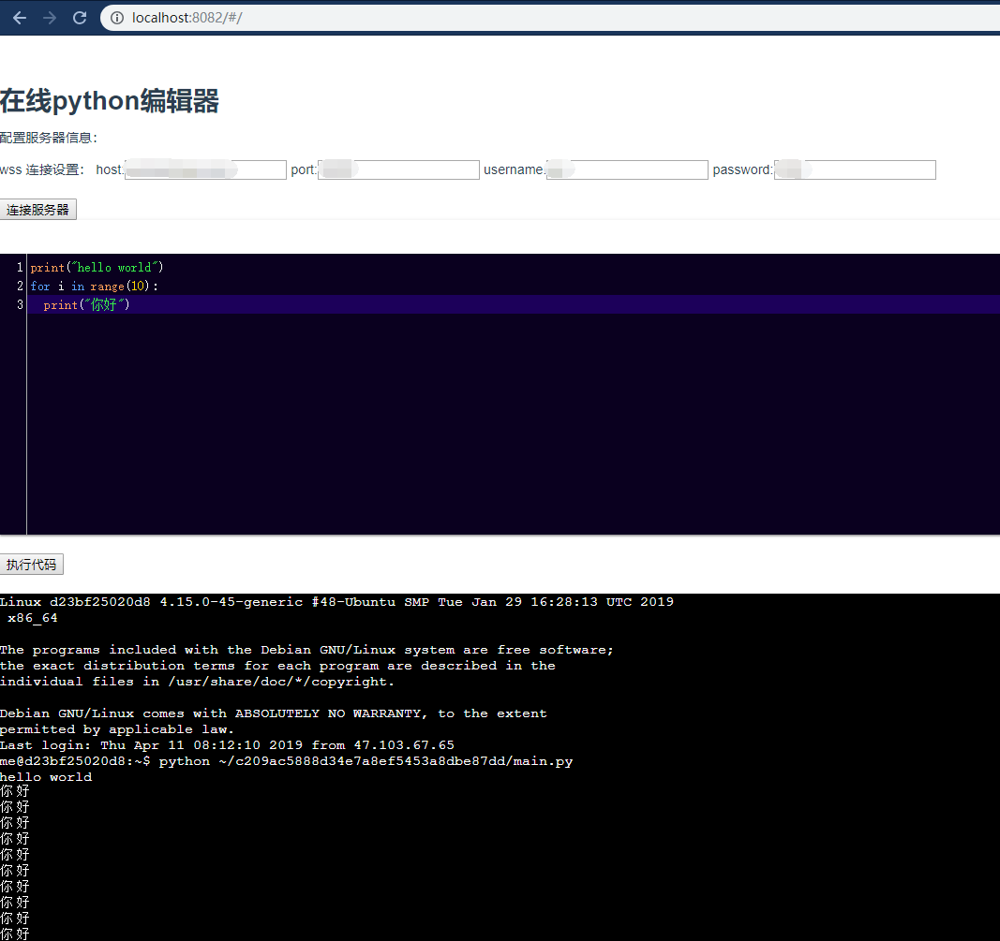

# Python 在线编辑器

一个基于 vue，xtermjs，aiohttp，paramiko 的 在线python编辑器，并且实现了可交互的终端。

# 后端启动
- 安装依赖  `pip install -r requirement.txt `
- 启动服务器 `cd server`,`python aioserver.py`

# 前端启动
- npm install && npm run serve
- 访问: http://localhost:8080/#/

# 效果图

